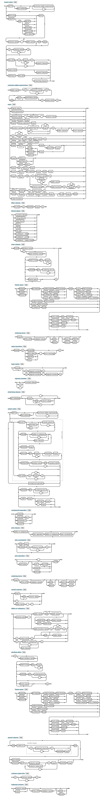

# Hengist

## µDOM

[µDOM Stateful Keyboard Event Handling](dev/mudom/static/index.html)

## SQL Complexity Visualization

SQL can be as easy as `insert into authors values ( $name, $birthday )`, right? Yes, and wrong. Here's what
happens when you fully expand [SQLite's Railroad digrams for the `insert`
statement](https://sqlite.org/lang_insert.html):

